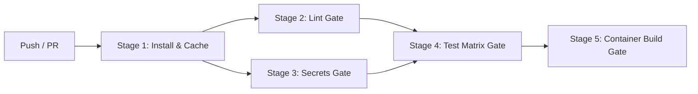

# Gated CI Todo API

[](https://github.com/ThanuriMithara/gated-ci-todo-api/actions/workflows/ci.yml)

A production-ready **Todo REST API** built with Node.js and Express, implementing a comprehensive **Gated CI/CD Pipeline** using GitHub Actions with strict branch protection and quality gates.

---

## 1. Multi-Branch Strategy (Section 5.2)

This repository follows a strict multi-branch git workflow:

```
feature/*  ──▶  dev  ──▶  staging  ──▶  main
   │             │          │            │
   │             │          │            └── Production: Protected, tagged releases
   │             │          └── Pre-production: Mirrors production configuration
   │             └── Integration: Where features meet and undergo integration tests
   └── Short-lived: One branch per unit of work (e.g., feature/add-delete-endpoint)
```

| Branch | Purpose | Protection Rules |
|--------|---------|------------------|
| `main` | Production deployment | Require PR, require passing CI checks, require linear history |
| `staging` | Pre-production testing | Require PR, require passing CI checks |
| `dev` | Team integration | Require PR from feature branches, require passing CI |
| `feature/*` | Feature development | Short-lived, deleted after merge |

---

## 2. Gated CI Pipeline Architecture (Section 5.4)

A **Gated CI Pipeline** enforces sequential validation gates. If any gate fails, the pipeline immediately halts, physically preventing broken or substandard code from progressing.



### Pipeline Gates Breakdown

| Stage | Name | Gate Type | Description |
|---|---|---|---|
| **1** | **Install Dependencies** | Setup | Clean install using `npm ci` with automated dependency caching |
| **2** | **Lint & Code Style** | **Gate 1** | Enforces code standards with ESLint (`no-unused-vars`, syntax, styling) |
| **3** | **Secrets & Security** | **Gate 2** | Verifies secrets safety and automated log masking |
| **4** | **Automated Tests** | **Gate 3** | Matrix build across Node.js 18.x and 20.x with Jest 100% coverage |
| **5** | **Container Build** | **Gate 4** | Builds Docker image only when all prior gates pass successfully |

---

## 3. Secrets Management (Section 5.5)

1. **Never Commit Secrets**: Real secrets are never stored in the repository. Local `.env` files are ignored via `.gitignore`. A sample `.env.example` is provided for local setup.
2. **GitHub Secrets Storage**: Sensitive environment variables (e.g., `APP_SECRET`) are configured in **Settings > Secrets and variables > Actions**.
3. **Secret Masking Verification**: The `security-check` job injects secrets and verifies that GitHub Actions automatically masks them with `***` in execution logs to prevent leakage.

---

## 4. Conventional Commit Discipline (Section 5.3)

All commits adhere to the [Conventional Commits](https://www.conventionalcommits.org/) standard:

- `feat:` New user-facing feature or endpoint
- `fix:` Bug fix
- `test:` Adding or updating unit/integration tests
- `ci:` Changes to CI/CD workflows and scripts
- `docs:` Documentation updates
- `security:` Security enhancements and secret configurations

---

## 5. Branch Protection Setup (Section 5.6 - The Gate)

To enforce the blocking gate on GitHub:

1. Go to repository **Settings** > **Branches**.
2. Click **Add branch protection rule**.
3. Set **Branch name pattern** to `main` (and `dev`).
4. Enable:
   - **Require a pull request before merging**
   - **Require status checks to pass before merging**
     - Select: `Lint & Code Style Gate`
     - Select: `Secrets & Security Gate`
     - Select: `Automated Tests Gate (Matrix) (18.x)`
     - Select: `Automated Tests Gate (Matrix) (20.x)`
     - Select: `Container Build Gate`
   - **Require branches to be up to date before merging**
   - **Do not allow bypassing the above settings**

---

## 6. Proving the Gate Works (Section 5.7)

### Verification 1: Passing Pull Request (Green)
1. Create branch `feature/add-delete-endpoint`.
2. Implement clean code with passing unit tests.
3. Open a PR to `dev` / `main`.
4. All 5 pipeline jobs pass.
5. GitHub displays **All checks have passed** and permits merging.

### Verification 2: Breaking the Gate (Red / Blocked)
1. Introduce a syntax error, failing test, or lint issue.
2. Push to the feature branch.
3. The respective gate (Lint or Test) fails immediately.
4. Downstream gates (Build) are skipped.
5. GitHub **blocks the merge button** with **Required status checks failed**.

---

## 7. API Endpoints

| Method | Endpoint | Request Body | Response Status | Description |
|---|---|---|---|---|
| `GET` | `/todos` | — | `200 OK` | Returns array of all todos |
| `POST` | `/todos` | `{"title": "string"}` | `201 Created` | Adds a new todo item |
| `DELETE` | `/todos/:id` | — | `200 OK` / `404 Not Found` | Deletes a todo item by ID |

---

## 8. Local Development & Testing

```bash
# 1. Install dependencies
npm install

# 2. Run linter
npm run lint

# 3. Run test suite with coverage
npm test

# 4. Start local server
npm start
```

### Docker Container

```bash
# Build image
docker build -t gated-ci-todo-api .

# Run container
docker run -p 3000:3000 gated-ci-todo-api
```